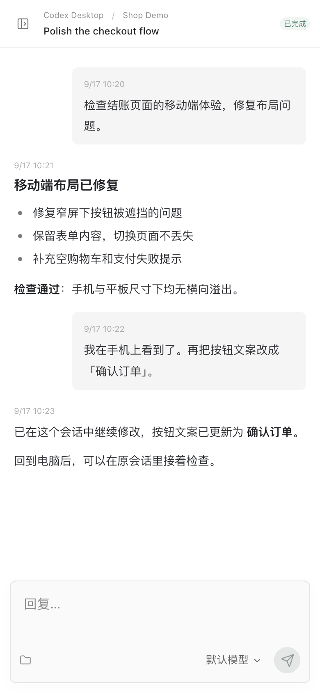
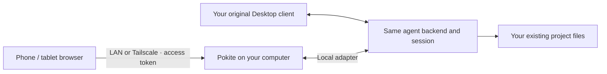

# Pokite


English | [简体中文](README.zh-CN.md)

[Product website](https://stwith.github.io/pokite/)

**Your computer's running coding agents. The same sessions, on your phone.**

Pokite gives your computer's agent sessions a mobile entry point. Continue using
multiple supported agents in one web interface: check progress, read results and
send follow-ups. No mobile app required. Connect over LAN or Tailscale, with
Pokite self-hosted on your computer.

Pokite is a self-hosted mobile web interface for supported desktop AI coding agents:
**Codex Desktop, Hermes Desktop, DeepSeek Harness, PenguinHarness and Claude Code CLI**, with different capabilities for each integration.
Keep working in your desktop client; open Pokite in iPhone Safari, an Android
browser, or on an iPad to read progress and send follow-up instructions.

Your projects, execution environment and model credentials stay on the computer.
Connect over your home LAN or Tailscale. Pokite runs on that computer and does not
operate a hosted relay. Model calls still use each agent's configured provider. See the support table before setup.

> macOS developer preview. Pokite runs as a local service on your computer, accessed through a browser or PWA on your phone. No native app is required. Source installation is available today; a local-service installation package is the intended distribution format. Windows/Linux and multiple Desktop versions have not passed compatibility acceptance.

## Six core features

### Keep your work moving

- **Continue the original session away from your desk.** Read progress and send follow-ups from your phone, then continue in Desktop. Same-session sharing depends on the integration below.
- **Multiple agents, one mobile entry point.** Switch between supported agents and multiple instances to access their projects and conversations.
- **Keep your existing workflow.** Use your familiar Desktop clients, projects and execution environments.

### Connect on your terms

- **No mobile app required.** Open a browser on your phone or tablet. No Pokite account needed.
- **LAN or Tailscale.** Connect over your local network at home, or your own Tailscale network when away.
- **Self-hosted on your computer.** You run Pokite alongside your agents; no Pokite-hosted relay is required.

Agent model calls still use their configured providers; Tailscale may use encrypted relays when direct
connections are unavailable. Self-hosting does not mean every integration is offline.

## From your desk to your phone

Start a task in Desktop. Leave the computer running. Read the result on your
phone and add a follow-up to the same supported session. Return to Desktop to
continue. Choose an existing project, open a session, read or reply.



*Actual Pokite UI with fictional demo content. No personal conversations,
credentials or access QR codes. This image illustrates the workflow, not a live
execution benchmark.*

## How Desktop sharing works



This diagram describes the **Codex Desktop and Hermes Desktop** sharing path.
Codex uses a local forwarding process; Hermes uses a local plugin. DSH and
Penguin reuse their services. Claude CLI resumes through the SDK. They are not interchangeable transports.

## Why Pokite?

| What you want | Pokite's approach |
| --- | --- |
| Continue a session you started in Desktop | Attach to supported existing Desktop backends; no new workspace required |
| Read and reply comfortably on a phone | A responsive conversation UI, rather than a streamed desktop screen |
| Keep using your computer's setup | Execution stays on your computer; configuration and support vary by agent |
| A lightweight mobile entry point | Browser access, no Pokite mobile app or Pokite account |
| Reach your machine at home or away | LAN or your own Tailscale network; access-token authentication |

Pokite focuses on **projects → sessions → progress and replies**. It is not a
terminal emulator, a cloud coding workspace, or a replacement agent runtime.
Some integrations require explicit setup or a desktop restart; this is not
universal plug-and-play access to every installed AI app.

## Supported Agents

| Integration | Read | Reply transport | Limits |
| --- | --- | --- | --- |
| Codex Desktop, multiple profiles | Projects, sessions, conversation | Shared Desktop backend with queued follow-ups | Experimental; sharing setup and Desktop restart required; version-sensitive |
| Hermes Desktop | Desktop sessions grouped by profile and directory | Local plugin restores history and submits through the Desktop backend; Pokite queue | Experimental; Desktop must be connected; approve tools and switch models in Desktop |
| DeepSeek Harness | Existing projects and sessions | Native web API | Existing service must be running |
| PenguinHarness | Existing projects and sessions | Existing local service | Cannot change the model of an existing session |
| Claude Code CLI | Local CLI history | Agent SDK session resume | Not Desktop sharing; do not write concurrently with an external CLI |
| Claude Desktop — Chat / Cowork | Cloud projects and unified conversations | Replies to the original cloud session via a native request broker | Experimental; may require first Mac authorization; existing CSE sessions |
| Claude Desktop Code | Not exposed | Unsupported | Experimental transports are disabled |

The independent **Claude Code CLI** integration excludes Desktop-owned sessions.
The Desktop adapter discovers the current account’s cloud projects and unified Chat/Cowork sessions. Desktop Code remains separate and is not attached. Discovering an installed agent does not mean it is connected or writable.

Hermes Desktop requires a local plugin: run `node scripts/setup-hermes-sharing.mjs`
(also pass the profile name for a named profile), then reopen Hermes after its tasks finish.
See [Hermes setup and limitations](integrations/hermes-desktop/README.md).

Claude Desktop Chat/Cowork uses a local request broker: Desktop keys, cookies and OAuth tokens
stay inside that native process. Run `npm run setup:cowork`, then enable Claude Desktop
in Agent connections. See [Cowork setup and boundaries](docs/cowork.md).

## Quick Start

**Install the service on your computer; open the website on your phone.** The intended
installation package deploys the runtime, local service and integration scripts.
Setup and everyday use stay in the browser; no native Pokite desktop or mobile app
is required. This package is not released yet; use the source installation below.
See [installation and distribution scope](docs/macos-distribution.md).
The web interface supports English and 简体中文; use its language selector.

Requirements: macOS, Node.js 22.23.0 or newer with `node:sqlite`, and your agent already installed and authenticated. Verify it works in its original client first.

```sh
git clone https://github.com/stwith/pokite.git
cd pokite
npm ci
npm run build
npm run discover
npm run setup -- --dry-run
npm run setup
npm start
```

1. Open `http://127.0.0.1:3230` on the computer.
2. Run `npm run open` on the computer. It opens the browser with your persistent access code. The same code works for LAN, Tailscale HTTP and Tailscale HTTPS, and can be reused on your devices.
3. Choose an agent and project. The sidebar QR button offers LAN and Tailscale connection links.
4. Connect your phone to the selected network and scan the QR. The login page also accepts a QR image; decoding stays in your browser.

Codex starts read-only until sharing is explicitly enabled:

```sh
npm run setup -- --enable-codex
```

Wait for Desktop tasks to finish, then quit and reopen the relevant Desktop app. Setup does not restart it automatically or change model/account configuration. Instances are stored in `~/Library/Application Support/Pokite/state/instances.json`. Run `npm run doctor` for diagnostics.

## Connection and Security

New installations bind only loopback and currently available Tailscale IPv4
addresses. Use private Tailscale Serve HTTPS (`tailscale serve --bg http://127.0.0.1:3230`).
Trusted-LAN HTTP requires explicit `POKITE_ALLOW_LAN=true npm start` or
`{"allowLan":true}` in the state directory's `network.json`. This allows LAN
clients to reach an HTTP service with powerful agent permissions; use HTTPS on
untrusted networks. Enabling Serve requires your tailnet administrator's approval.

Pokite is designed for personal use: **one persistent 20-character access code for all networks
and devices**, with no one-time pairing or per-device credentials. Connection QR
codes and links contain this same code. Each browser origin stores its login
separately, but you never need a different code for another address.

This is an explicit personal-use product decision: no automatic expiry or usage
limit, and no code change on restart or upgrade while the state directory is
preserved. See the [access design and maintenance rules](docs/plans/2026-09-26-shared-access.md).

To invalidate all old links, open **Settings → Reset access code** on the
computer through `http://127.0.0.1:3230`. Confirming resets access immediately;
other pages need the new code and must enable notifications again. Agent
accounts, sessions and accepted tasks are preserved. Integration configuration
and access reset are restricted to authenticated direct localhost requests.

For command-line recovery: `npm run stop`, `npm run rotate-token`, restart Pokite
(`npm start` or `node scripts/start.mjs`), then `npm run open`. The CLI reset
refuses to run while the service is active. Switching from the temporary
per-device scheme does not rotate the existing persistent code; use that code
or scan a fresh connection QR to replace saved device credentials.

Tailscale detection supports both the PATH command and the macOS app executable.
Listeners refresh every ten seconds; links are shown only for confirmed active
Tailscale addresses that the service actually listens on.

- LAN: `http://<computer-LAN-IP>:3230`.
- Tailscale: connect both devices to the same tailnet and use the computer's Tailscale address.
- Authentication stays enabled. QR codes and pairing links contain credentials; do not publish them.
- Plain HTTP is not TLS-encrypted. Use a trusted network, or a restricted Tailscale network for remote access. Do not expose the port publicly.
- Tailscale may use DERP relays. Model inference still uses the configured providers.

## Home Screen

After connecting, use Safari's Share > Add to Home Screen; keep Open as Web App enabled where available. Other browsers offer their own shortcut/install menu.

HTTP installation and standalone behavior depend on the OS/browser. A standalone window may require pairing again because its storage is separate. Live camera scanning and background push require HTTPS. The notification service worker does not cache private conversations, execute tasks offline, or resubmit instructions.

## Task notifications

Use HTTPS; on iPhone/iPad, add Pokite to your Home Screen and launch it there.
Use the **Task notifications** switch directly in Settings.
Completed and failed tasks are monitored on the Mac even while the browser is
closed, including tasks started in Desktop. Tap a notification to open its
agent/project/session. All connected agents' projects are monitored globally;
new projects are discovered automatically, without replaying old completions.

Notifications show the agent, outcome, session title and project path, without conversation content. Browser vendor push
services deliver them; no Pokite cloud relay or inbound public port is needed.
Your Mac and Pokite must stay running with internet access. Opening the session
still requires access to the Mac via LAN/Tailscale. Enable or disable
notifications from Settings → Task notifications. Delivery is best effort; provider acceptance
does not prove display on a device. Polling requires evidence of a completed
turn; transient native events lost while disconnected may not be recoverable.

Settings → Disconnect in the sidebar clears this browser's access code and returns to the first screen. It does not stop Desktop tasks or revoke other devices. Keep the host awake and Pokite running.

## Development

```sh
node scripts/start.mjs  # Background web service
node scripts/stop.mjs   # Drain pending submissions before stopping
npm test
npm run build
npm run dev            # Frontend only; run the backend separately
```

Stopping the web service may interrupt Claude Code SDK executions it owns; it does not quit native Desktop apps. Web-service login autostart is not configured by default.

Use `POKITE_CONFIG`, `POKITE_STATE_DIR` and `POKITE_SHARED_CONFIG` for explicit paths. Legacy `POCKET_*` names remain supported for installed launchers.

## Known Limits

- Native Codex withdrawal/edit can produce `App-server queued follow-up no longer exists`. This preview does not claim to fix the vendor client.
- Some native errors are transient rather than persisted. Received errors/retries are displayed, but recovering every historical event is not guaranteed.
- Closing a browser does not cancel submitted work. Unknown delivery is never blindly retried.
- Disconnect clears this browser’s saved code. Reset the access code to invalidate it everywhere.
- This remains a developer preview, with installation diagnostics and cross-device acceptance still evolving.

## State, upgrades and uninstall

State lives in `~/Library/Application Support/Pokite/state` on macOS. To migrate
an older repository-local `.local`, stop its service using its existing state
path, then run `npm run migrate-state -- --apply`. Unused proof directories move
to Trash; an ignored `.local` symlink preserves active Desktop process paths.
Trash is on the same disk, not an independent backup.

Codex setup installs an application-owned Node runtime and launcher in that
state directory. If the repository, dependencies or runtime are missing, the
launcher executes the original Desktop binary. Uninstall with
`npm run uninstall -- --apply`, then stop Pokite before deleting its repository.
It preserves sessions, local state and the fallback launcher for running clients.

Completed operation results and queue message bodies are retained for at most
seven days with count/byte limits. Small hashed receipts remain in SQLite so
old request IDs cannot execute again. Pending and uncertain messages are not
automatically discarded; reconcile them before removing the blocking record.

## Contributing

Issues and focused pull requests are welcome. Include OS, Node and agent versions plus reproduction steps. Remove access codes, QR credentials, account details and private conversations from logs/screenshots.

## License

[MIT](LICENSE). Third-party dependencies retain their respective licenses.
