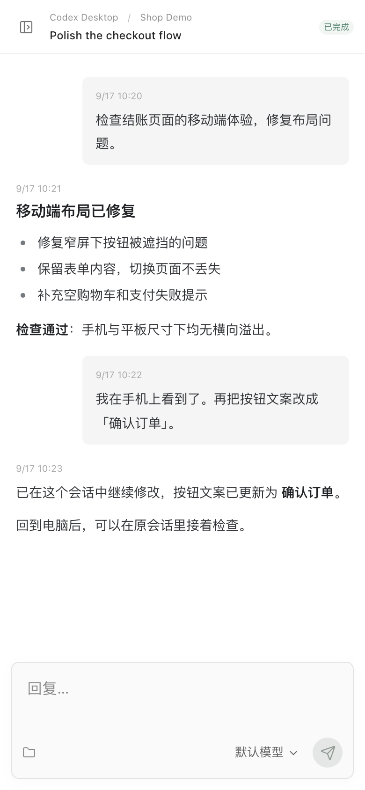
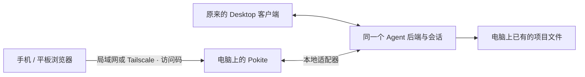

# Pokite · 口袋风筝


[English](README.md) | 简体中文

[产品介绍网站](https://stwith.github.io/pokite/)

**电脑上的 Agent 继续跑，手机上接着聊同一个会话。**

Pokite 给电脑上的 Agent 会话加一个手机入口。离开电脑后，在同一个网页里
继续使用多个受支持的 Agent，查看进展、阅读结果、补充指令。无需手机 App，
通过局域网或 Tailscale 连接，自托管在你的电脑上。

Pokite 是一个自托管的移动端网页入口，让你从手机或平板继续使用电脑上
受支持的 Desktop Agent 会话。覆盖 **Codex Desktop、Hermes Desktop、
DeepSeek Harness、PenguinHarness、Claude Code CLI 和 Claude Desktop Cowork**，
各接入的能力与限制见下表。

你继续在原来的桌面客户端工作，手机打开网页，就能查看进展、阅读结果、补充指令。
项目、执行环境和模型凭据留在电脑上，通过家庭局域网或 Tailscale 连接。
Pokite 不运营外部中转服务器；Cowork 使用 Anthropic 远程会话接口，模型推理
仍使用各 Agent 原先配置的服务。

> macOS 开发者预览版。尚无签名安装包，也未完成 Windows/Linux 和多种 Desktop 版本的兼容验收。

## 六个核心特点

### 使用价值

- **离开电脑，继续原会话**：手机查看进展、阅读结果、补充指令，回到 Desktop 接着聊。同一会话共享的具体支持范围见下表。
- **多个 Agent，一个入口**：统一访问受支持的不同 Agent 和多个实例的项目与会话。
- **保留原来的工作方式**：继续使用熟悉的 Desktop 客户端、项目和执行环境。

### 连接方式

- **无需手机 App**：手机、平板打开浏览器即可，不需要注册 Pokite 账号。
- **局域网 / Tailscale**：在家通过局域网访问，外出通过自己的 Tailscale 网络连接。
- **自托管在你的电脑上**：Pokite 服务由你运行，不依赖 Pokite 托管的中转服务器。

模型调用仍使用各 Agent 配置的服务；Cowork 控制链路依赖 Anthropic 服务，
Tailscale 在无法直连时可能使用加密中继。自托管不等于所有接入都能离线运行。

## 离开电脑，也能接着聊

在 Desktop 开始任务，电脑保持运行。拿起手机查看结果，再给同一个受支持的
会话补充一条指令。回到电脑后，从原会话继续。整个流程只有：选择已有项目 →
打开会话 → 阅读或回复。



*真实 Pokite 界面，使用虚构的演示项目和对话。图片不含个人会话、凭据或访问二维码；
用于说明交互流程，不代表真实任务执行或性能测试。*

## 手机如何共享 Desktop 会话



上图对应 **Codex Desktop、Hermes Desktop** 的共享方式：Codex 使用本地转发进程，
Hermes 使用本地插件。DSH 和 Penguin 复用已有服务；Claude CLI 通过 SDK 恢复执行；
Cowork 的控制链路经过 Anthropic 服务。不同接入不能一概称为纯本地 Desktop 共享。

## Pokite 的取舍

| 你需要什么 | Pokite 怎么做 |
| --- | --- |
| 继续电脑里已经开始的会话 | 优先接入原 Desktop 后端，不要求迁移到新的工作区 |
| 手机上方便地阅读和回复 | 使用适合小屏幕的对话界面，不是桌面投屏 |
| 保留电脑上已经配置好的环境 | 任务仍在电脑执行，各 Agent 的接入能力单独说明 |
| 一个轻便的移动入口 | 不需要 Pokite 手机 App，也不需要注册 Pokite 账号 |
| 在家或外出都能访问 | 使用局域网或自己的 Tailscale 网络，保留访问码认证 |

我们聚焦 **项目 → 会话 → 查看进展与回复**，不做完整终端、云端开发工作区或
另一套 Agent 运行时。部分接入需要安装插件、启用共享或重启 Desktop；目前不承诺
所有本机 AI 应用都能即装即用。

## 支持的 Agent

| 接入 | 查看 | 发送与执行方式 | 边界 |
| --- | --- | --- | --- |
| Codex Desktop，多实例 | 项目、会话、对话 | 共享 Desktop 原有后端，支持排队 | 实验性；需启用共享并重启对应 Desktop，版本敏感 |
| Hermes Desktop | 按配置与目录分组的 Desktop 会话 | 本地插件恢复历史会话并使用原后端提交，支持 Pokite 排队 | 实验性；Desktop 保持连接；审批和模型切换在 Desktop 完成 |
| DeepSeek Harness | 已有项目与会话 | 复用原生 Web API | 原服务需运行 |
| PenguinHarness | 已有项目与会话 | 复用本地服务 | 已有会话不支持切换模型 |
| Claude Code CLI | 本地 CLI 会话 | Agent SDK 恢复执行 | 不共享 Desktop；不要与外部 CLI 同时写同一会话 |
| Claude Desktop Cowork | 当前账号关联会话 | Anthropic 远程会话接口 | **不是纯局域网控制**；可能需要钥匙串授权；不支持新建、审批或切换模型 |
| Claude Desktop Code / Chat | 不提供 | 不支持 | 相关实验接入已关闭 |

独立 Claude Code 会排除 Desktop 所属会话。发现已安装的 Agent 不代表它已经连接或支持发送。

## 开始使用

要求：macOS、Node.js 22.23.0 或更高版本（支持 `node:sqlite`），以及已安装、登录的 Agent。推荐先确认它在原客户端能正常工作。

```sh
git clone https://github.com/stwith/pokite.git
cd pokite
npm ci
npm run build
npm run discover
npm run setup -- --dry-run
npm run setup
npm start
```

1. 在电脑打开 `http://127.0.0.1:3230`。
2. 首次启动会生成 `.local/access-token`，输入其中的访问码连接。这不是模型 API Key。
3. 在侧栏选择 Agent 和项目。底部二维码按钮提供局域网和 Tailscale 两种连接地址。
4. 手机连接对应网络后扫码，或在 Pokite 首屏选择二维码图片。识别在浏览器本地进行，不上传照片。

Codex 初次发现默认只读。明确启用共享：

```sh
npm run setup -- --enable-codex
```

等待 Desktop 任务完成后，退出并重新打开对应 Desktop。安装脚本不自动重启它，也不改变模型和账号配置。实例配置保存在 `.local/instances.json`，可使用 `npm run doctor` 检查环境。

## Hermes Desktop 接入

```sh
node scripts/setup-hermes-sharing.mjs       # 默认配置
node scripts/setup-hermes-sharing.mjs main  # 使用 main 配置时另外执行
```

等待 Hermes 任务结束后重新打开 Hermes Desktop，再运行发现与配置流程。已有
`.local/instances.json` 的安装需增加 `provider: "hermesDesktop"`、名称和 Hermes
根目录（通常 `~/.hermes`）。不要覆盖其他实例配置。

插件安装在 Hermes 的 `plugins/pokite`，只提供本机会话快照、新建和发送接口，
沿用 Hermes 后端认证。不会修改 Hermes 应用包，不申请覆盖内置工具，也不启动
第二个 Agent 后端。历史会话在发送时由本地插件恢复，无需先在桌面点开。模型调用
失败仍由原模型服务处理，Pokite 显示原生错误。停用可运行 `hermes plugins disable pokite`
（命名配置加 `--profile main`），然后重启 Hermes；不删除会话。

## 网络与认证

Claude Desktop Cowork 使用专用的 macOS 钥匙串工具。开发者预览版先运行
`node scripts/setup-claude-keychain.mjs`，需要 Xcode Command Line Tools 和本机
代码签名证书。首次访问时确认请求方是 **Pokite Claude Access**，选择“始终允许”。
工具固定安装在用户的 `Library/Application Support/Pokite/Keychain`；重复安装
不会替换未变化的已签名二进制。密钥只传入服务内存，不落盘，不新增常驻进程。
普通服务重启可沿用系统保存的访问许可；钥匙串锁定、条目重建或签名变更仍可能
要求重新授权。当前未提供面向普通用户的 Developer ID 签名安装包。

- 局域网：`http://<电脑局域网IP>:3230`。
- Tailscale：两台设备连入同一 tailnet 后，使用电脑的 Tailscale 地址。
- 保留访问码认证；二维码和连接链接含凭据，不能公开分享。
- 普通 HTTP 没有 TLS 加密。仅在可信网络使用；远程访问优先使用受限的 Tailscale 网络。不要把端口暴露到公网。
- Tailscale 自身可能使用 DERP 中继。Pokite 不运营中转服务器；Cowork 控制链路和 Agent 模型调用仍依赖原厂或已配置的外部服务。

## 添加到主屏幕

手机完成连接后，可在 Safari 分享菜单选择“添加到主屏幕”，如有“作为 Web App 打开”，保持开启。其他浏览器按其菜单操作。

HTTP 地址的独立窗口/安装行为取决于系统。当前提供 Manifest 和图标，没有 Service Worker、离线执行或后台重发。独立窗口可能不继承浏览器认证，可用二维码图片重新配对。HTTP 不支持网页内实时摄像头扫码。

侧栏“退出连接”仅清除当前浏览器访问码，不停止电脑上的任务，也不撤销其他设备的凭据。电脑必须保持开机且 Pokite 服务运行。

## 运行与开发

```sh
node scripts/start.mjs  # 后台启动网页服务
node scripts/stop.mjs   # 等待提交持久化后停止服务
npm test
npm run build
npm run dev            # 前端开发服务，后端需单独启动
```

停止网页服务可能中断它拥有的 Claude Code SDK 执行。它不会退出原生 Desktop。默认没有网页服务的开机自启。

高级配置继续使用 `POCKET_CONFIG`、`POCKET_STATE_DIR` 等既有环境变量。它们是运行接口，品牌名称为 Pokite。

## 已知限制

- Codex Desktop 原生撤回再编辑可能出现 `App-server queued follow-up no longer exists`；首版不宣称已修复厂商客户端问题。
- 某些原生错误不会持久化；网页可以显示收到的错误和重试事件，但不保证恢复所有历史瞬时事件。
- 浏览器关闭或离线不代表任务已取消。结果不明的提交不会盲目重发。
- 没有逐设备撤销能力；退出浏览器不等于吊销已复制的令牌。
- 当前仍是开发者预览版，安装诊断和跨设备体验还在迭代。

## 贡献与许可

欢迎提交 Issue，附上系统、Node 和 Agent 版本及复现步骤。请删除访问码、二维码、账号、真实会话和日志中的凭据。

MIT License，见 [LICENSE](LICENSE)。第三方依赖沿用各自许可证。
